# Chrome拡張機能「動画音声文字起こしツール」アーキテクチャ設計書

## 🏗️ 概要
本文書では、Chrome拡張機能「動画音声文字起こしツール」のアーキテクチャ設計を詳細に定義し、システム全体の構造と各コンポーネントの役割を明確化します。

## 📐 全体アーキテクチャ図

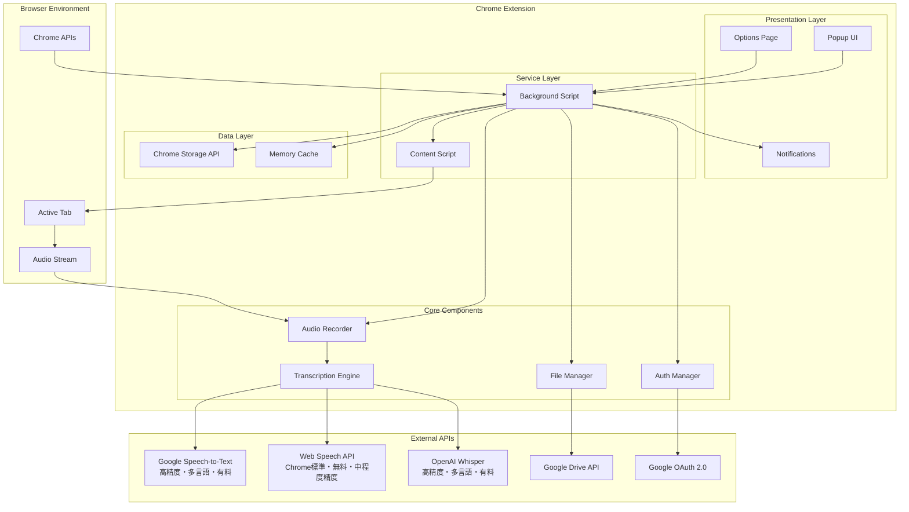
```mermaid
graph TB
    subgraph "Chrome Extension"
        subgraph "Presentation Layer"
            UI[Popup UI]
            OPT[Options Page]
            NOT[Notifications]
        end
        
        subgraph "Service Layer"
            BG[Background Script]
            CS[Content Script]
        end
        
        subgraph "Data Layer"
            STOR[Chrome Storage API]
            CACHE[Memory Cache]
        end
        
        subgraph "Core Components"
            AR[Audio Recorder]
            TR[Transcription Engine]
            FM[File Manager]
            AM[Auth Manager]
        end
    end
      subgraph "External APIs"
        GSTT[Google Speech-to-Text<br/>高精度・多言語・有料]
        WSA[Web Speech API<br/>Chrome標準・無料・中程度精度]
        WHISPER[OpenAI Whisper<br/>高精度・多言語・有料]
        GDRIVE[Google Drive API]
        OAUTH[Google OAuth 2.0]
    end
    
    subgraph "Browser Environment"
        TAB[Active Tab]
        AUDIO[Audio Stream]
        CHROME[Chrome APIs]
    end
    
    UI --> BG
    OPT --> BG
    BG --> CS
    CS --> TAB
    TAB --> AUDIO
      BG --> AR
    AR --> TR
    TR --> GSTT
    TR --> WSA
    TR --> WHISPER
    BG --> FM
    FM --> GDRIVE
    BG --> AM
    AM --> OAUTH
    
    BG --> STOR
    BG --> CACHE
    BG --> NOT
    
    AUDIO --> AR
    CHROME --> BG
```

## 🎯 レイヤー構成

### 1. プレゼンテーション層 (Presentation Layer)

#### Popup UI
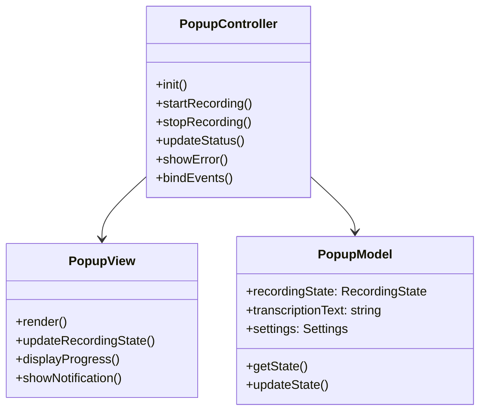
```mermaid
classDiagram
    class PopupController {
        +init()
        +startRecording()
        +stopRecording()
        +updateStatus()
        +showError()
        +bindEvents()
    }
    
    class PopupView {
        +render()
        +updateRecordingState()
        +displayProgress()
        +showNotification()
    }
    
    class PopupModel {
        +recordingState: RecordingState
        +transcriptionText: string
        +settings: Settings
        +getState()
        +updateState()
    }
    
    PopupController --> PopupView
    PopupController --> PopupModel
```

#### Options Page
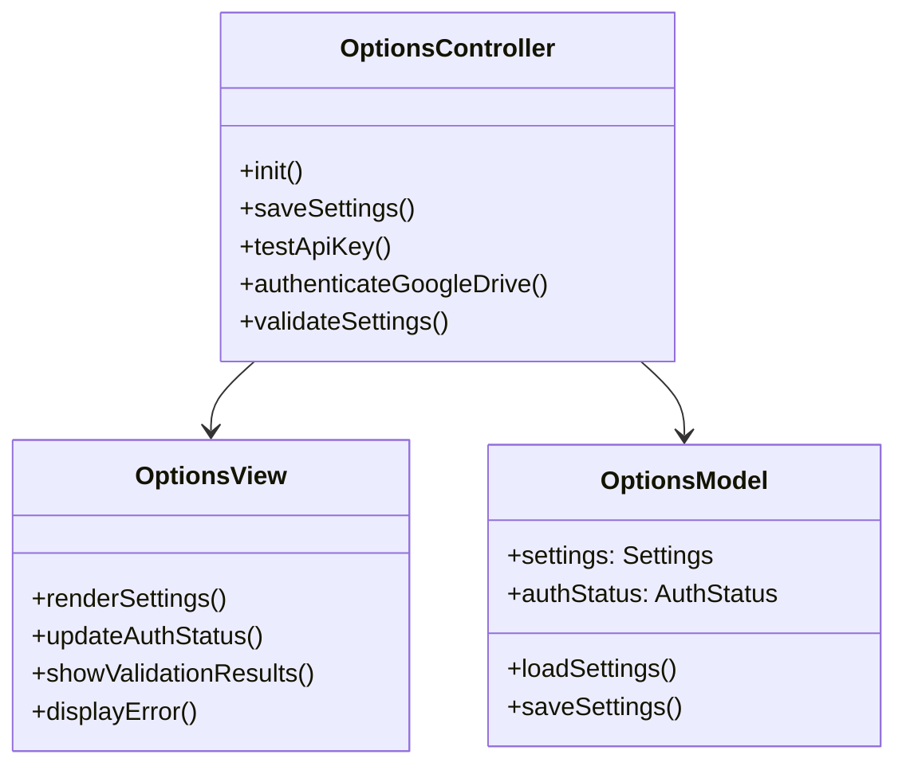
```mermaid
classDiagram
    class OptionsController {
        +init()
        +saveSettings()
        +testApiKey()
        +authenticateGoogleDrive()
        +validateSettings()
    }
    
    class OptionsView {
        +renderSettings()
        +updateAuthStatus()
        +showValidationResults()
        +displayError()
    }
    
    class OptionsModel {
        +settings: Settings
        +authStatus: AuthStatus
        +loadSettings()
        +saveSettings()
    }
    
    OptionsController --> OptionsView
    OptionsController --> OptionsModel
```

### 2. サービス層 (Service Layer)

#### Background Script
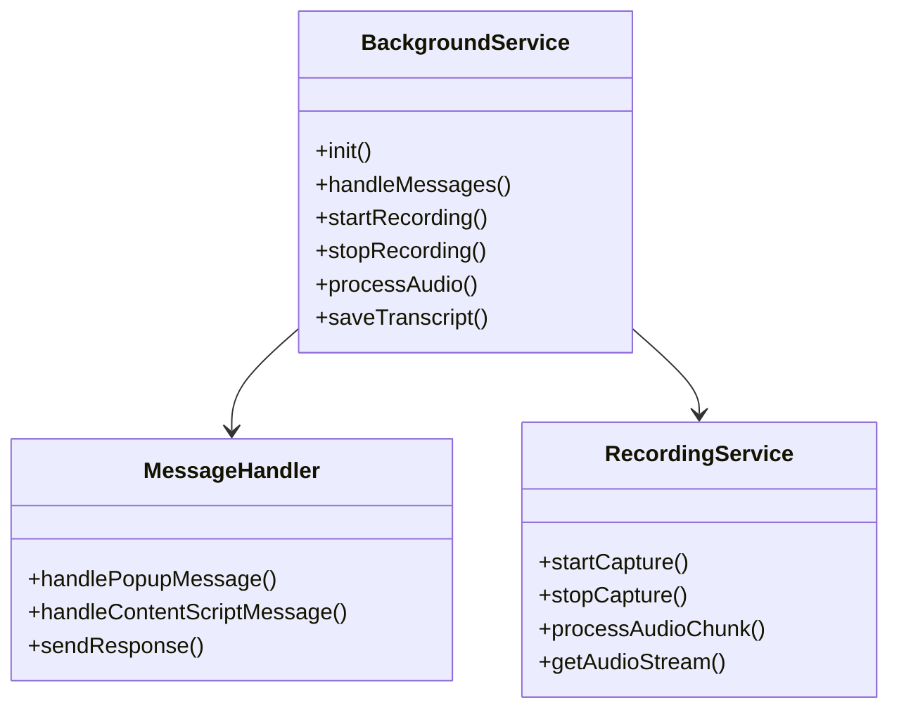
```mermaid
classDiagram
    class BackgroundService {
        +init()
        +handleMessages()
        +startRecording()
        +stopRecording()
        +processAudio()
        +saveTranscript()
    }
    
    class MessageHandler {
        +handlePopupMessage()
        +handleContentScriptMessage()
        +sendResponse()
    }
    
    class RecordingService {
        +startCapture()
        +stopCapture()
        +processAudioChunk()
        +getAudioStream()
    }
    
    BackgroundService --> MessageHandler
    BackgroundService --> RecordingService
```

#### Content Script
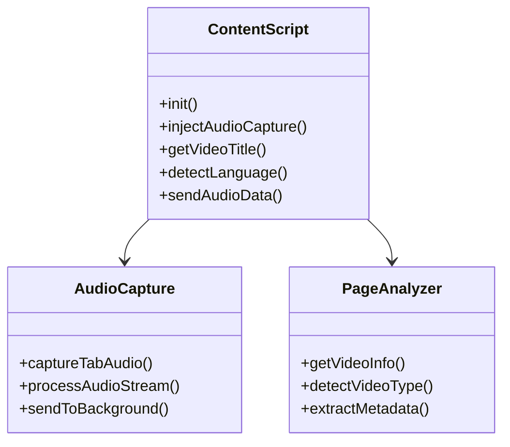
```mermaid
classDiagram
    class ContentScript {
        +init()
        +injectAudioCapture()
        +getVideoTitle()
        +detectLanguage()
        +sendAudioData()
    }
    
    class AudioCapture {
        +captureTabAudio()
        +processAudioStream()
        +sendToBackground()
    }
    
    class PageAnalyzer {
        +getVideoInfo()
        +detectVideoType()
        +extractMetadata()
    }
    
    ContentScript --> AudioCapture
    ContentScript --> PageAnalyzer
```

### 3. データ層 (Data Layer)

#### Storage Management
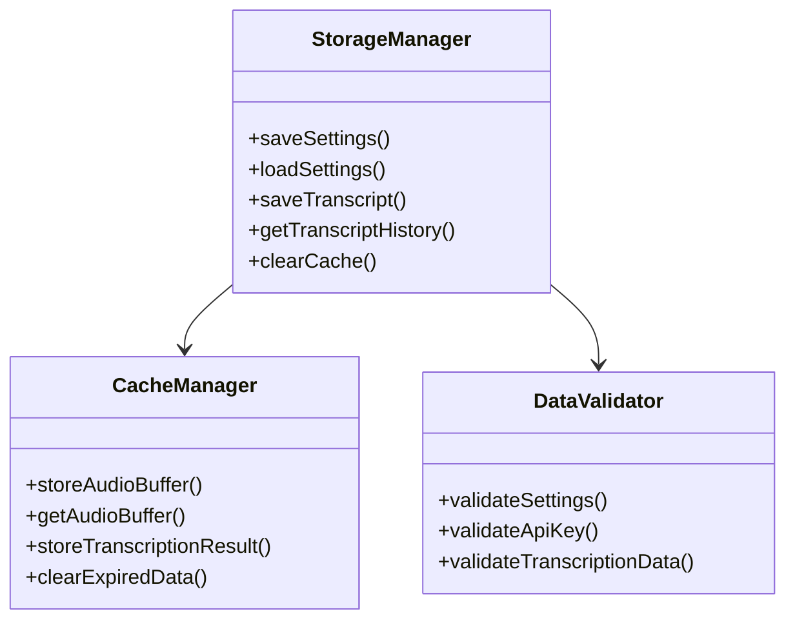
```mermaid
classDiagram
    class StorageManager {
        +saveSettings()
        +loadSettings()
        +saveTranscript()
        +getTranscriptHistory()
        +clearCache()
    }
    
    class CacheManager {
        +storeAudioBuffer()
        +getAudioBuffer()
        +storeTranscriptionResult()
        +clearExpiredData()
    }
    
    class DataValidator {
        +validateSettings()
        +validateApiKey()
        +validateTranscriptionData()
    }
    
    StorageManager --> CacheManager
    StorageManager --> DataValidator
```

## 🔧 コアコンポーネント設計

### 1. Audio Recorder

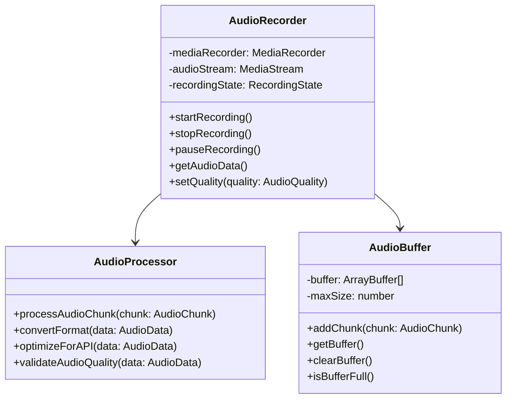
```mermaid
classDiagram
    class AudioRecorder {
        -mediaRecorder: MediaRecorder
        -audioStream: MediaStream
        -recordingState: RecordingState
        +startRecording()
        +stopRecording()
        +pauseRecording()
        +getAudioData()
        +setQuality(quality: AudioQuality)
    }
    
    class AudioProcessor {
        +processAudioChunk(chunk: AudioChunk)
        +convertFormat(data: AudioData)
        +optimizeForAPI(data: AudioData)
        +validateAudioQuality(data: AudioData)
    }
    
    class AudioBuffer {
        -buffer: ArrayBuffer[]
        -maxSize: number
        +addChunk(chunk: AudioChunk)
        +getBuffer()
        +clearBuffer()
        +isBufferFull()
    }
    
    AudioRecorder --> AudioProcessor
    AudioRecorder --> AudioBuffer
```

### 2. Transcription Engine

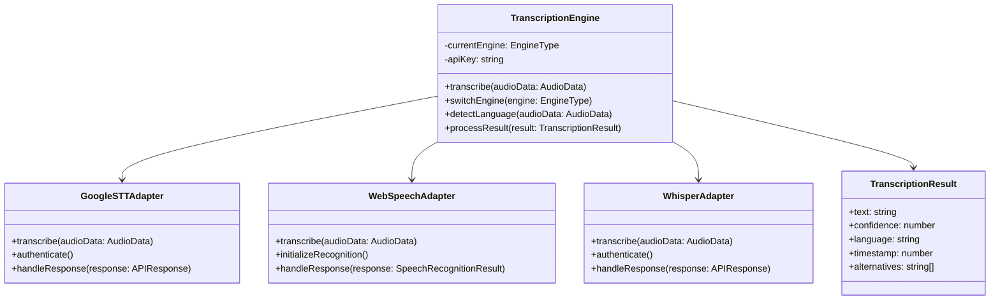
```mermaid
classDiagram
    class TranscriptionEngine {
        -currentEngine: EngineType
        -apiKey: string
        +transcribe(audioData: AudioData)
        +switchEngine(engine: EngineType)
        +detectLanguage(audioData: AudioData)
        +processResult(result: TranscriptionResult)
    }
      class GoogleSTTAdapter {
        +transcribe(audioData: AudioData)
        +authenticate()
        +handleResponse(response: APIResponse)
    }
    
    class WebSpeechAdapter {
        +transcribe(audioData: AudioData)
        +initializeRecognition()
        +handleResponse(response: SpeechRecognitionResult)
    }
    
    class WhisperAdapter {
        +transcribe(audioData: AudioData)
        +authenticate()
        +handleResponse(response: APIResponse)
    }
    
    class TranscriptionResult {
        +text: string
        +confidence: number
        +language: string
        +timestamp: number
        +alternatives: string[]
    }
    
    TranscriptionEngine --> GoogleSTTAdapter
    TranscriptionEngine --> WebSpeechAdapter
    TranscriptionEngine --> WhisperAdapter
    TranscriptionEngine --> TranscriptionResult
```

### 3. File Manager

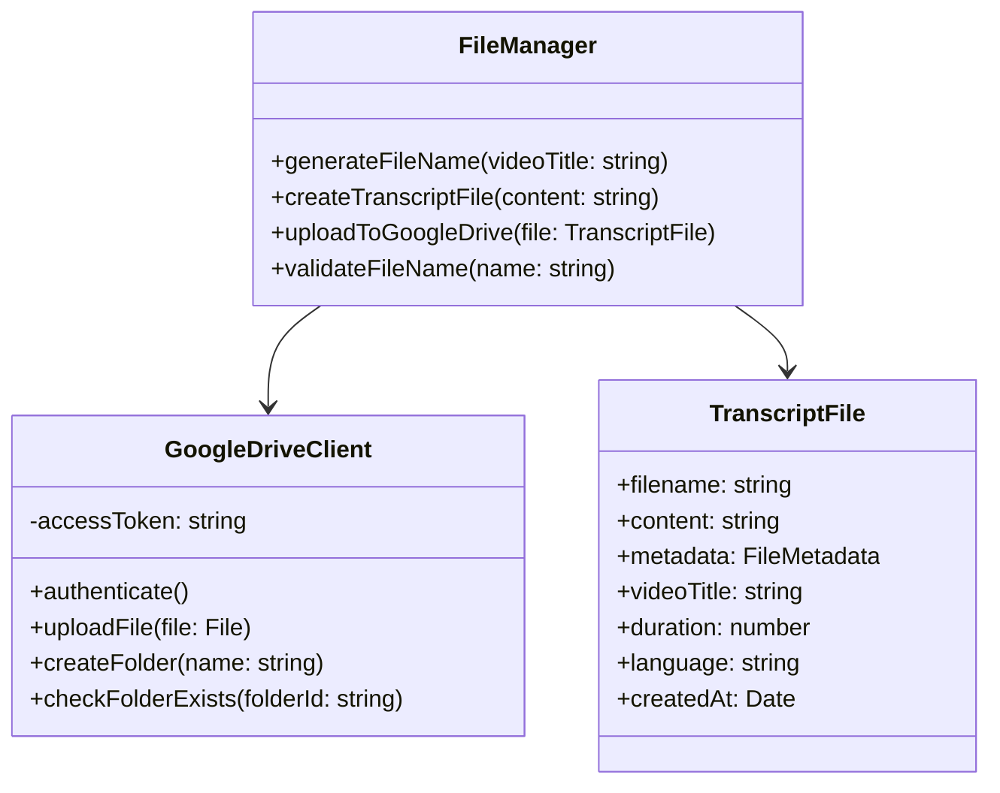
```mermaid
classDiagram
    class FileManager {
        +generateFileName(videoTitle: string)
        +createTranscriptFile(content: string)
        +uploadToGoogleDrive(file: TranscriptFile)
        +validateFileName(name: string)
    }
    
    class GoogleDriveClient {
        -accessToken: string
        +authenticate()
        +uploadFile(file: File)
        +createFolder(name: string)
        +checkFolderExists(folderId: string)
    }
    
    class TranscriptFile {
        +filename: string
        +content: string
        +metadata: FileMetadata
        +videoTitle: string
        +duration: number
        +language: string
        +createdAt: Date
    }
    
    FileManager --> GoogleDriveClient
    FileManager --> TranscriptFile
```

### 4. Auth Manager

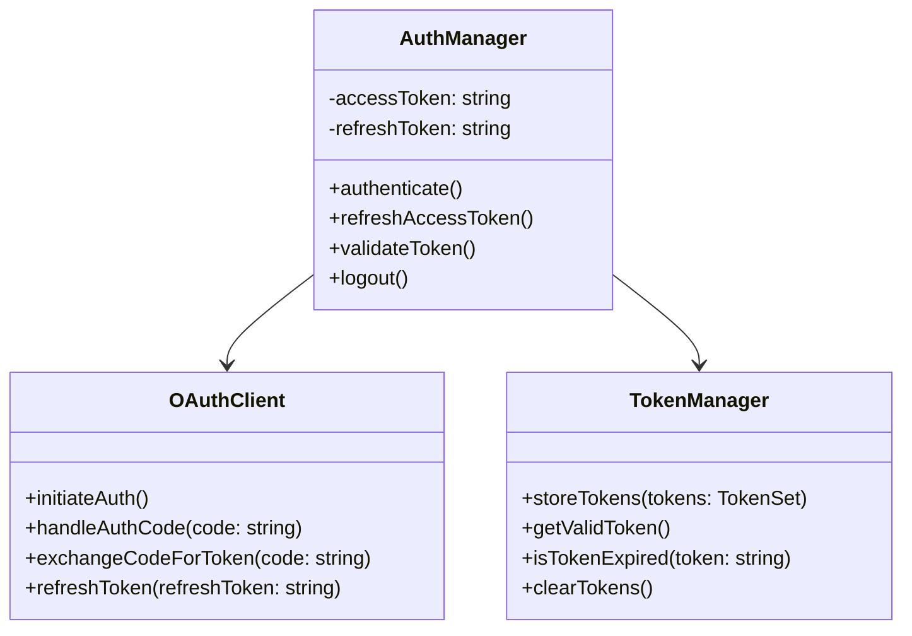
```mermaid
classDiagram
    class AuthManager {
        -accessToken: string
        -refreshToken: string
        +authenticate()
        +refreshAccessToken()
        +validateToken()
        +logout()
    }
    
    class OAuthClient {
        +initiateAuth()
        +handleAuthCode(code: string)
        +exchangeCodeForToken(code: string)
        +refreshToken(refreshToken: string)
    }
    
    class TokenManager {
        +storeTokens(tokens: TokenSet)
        +getValidToken()
        +isTokenExpired(token: string)
        +clearTokens()
    }
    
    AuthManager --> OAuthClient
    AuthManager --> TokenManager
```

## 📡 API インテグレーション設計

### 文字起こしエンジン選択戦略

各エンジンの特徴と選択基準：

| エンジン | 精度 | コスト | 接続性 | 多言語対応 | 推奨用途 |
|---------|------|--------|--------|------------|----------|
| Google Speech-to-Text | 高 | 有料 | API | 優秀 | 高品質が必要な場合 |
| Web Speech API | 中 | 無料 | ブラウザ標準 | 良好 | 基本的な文字起こし |
| OpenAI Whisper | 高 | 有料 | API | 優秀 | 多言語・高精度が必要 |

### 1. Google Speech-to-Text API

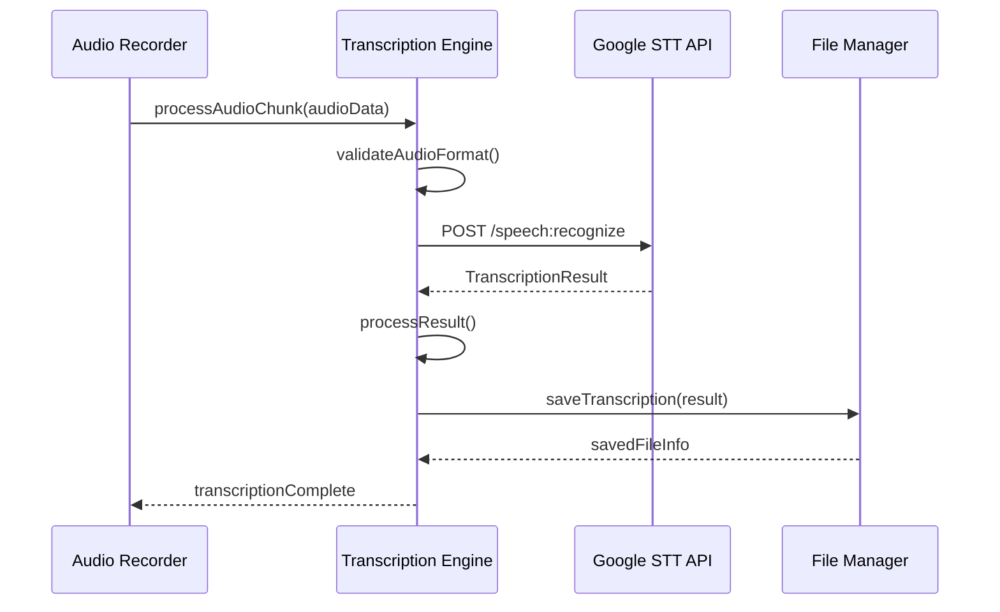
```mermaid
sequenceDiagram
    participant AR as Audio Recorder
    participant TE as Transcription Engine
    participant GST as Google STT API
    participant FM as File Manager
    
    AR->>TE: processAudioChunk(audioData)
    TE->>TE: validateAudioFormat()
    TE->>GST: POST /speech:recognize
    GST-->>TE: TranscriptionResult
    TE->>TE: processResult()
    TE->>FM: saveTranscription(result)
    FM-->>TE: savedFileInfo
    TE-->>AR: transcriptionComplete
```

### 2. Web Speech API

Web Speech APIはChrome標準のブラウザAPIで、追加のAPIキーや認証が不要です。

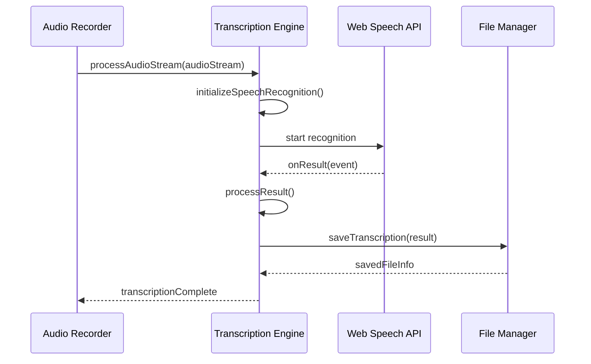
```mermaid
sequenceDiagram
    participant AR as Audio Recorder
    participant TE as Transcription Engine
    participant WSA as Web Speech API
    participant FM as File Manager
    
    AR->>TE: processAudioStream(audioStream)
    TE->>TE: initializeSpeechRecognition()
    TE->>WSA: start recognition
    WSA-->>TE: onResult(event)
    TE->>TE: processResult()
    TE->>FM: saveTranscription(result)
    FM-->>TE: savedFileInfo
    TE-->>AR: transcriptionComplete
```

**Web Speech API の特徴:**
- ✅ **Chrome標準**: 追加インストール不要
- ✅ **無料**: APIキーや課金不要
- ⚠️ **中程度の精度**: 基本的な用途に適用
- ✅ **リアルタイム処理**: ストリーミング対応
- ⚠️ **ネットワーク依存**: オンライン接続必須

**実装上の考慮事項:**
- `SpeechRecognition` APIの利用
- 言語設定と自動検出
- 継続的認識のための適切な設定
- エラーハンドリング（ネットワーク断、タイムアウト等）

### 3. OpenAI Whisper API

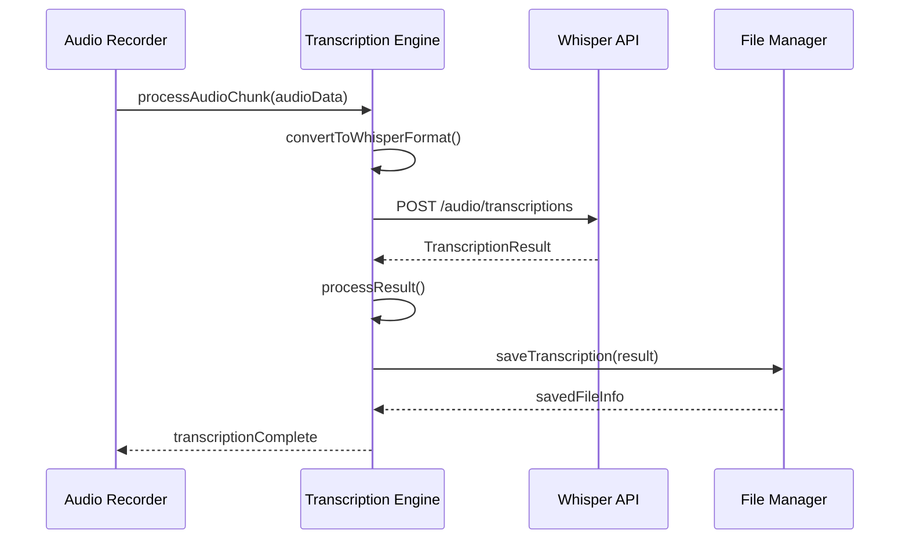
```mermaid
sequenceDiagram
    participant AR as Audio Recorder
    participant TE as Transcription Engine
    participant WH as Whisper API
    participant FM as File Manager
    
    AR->>TE: processAudioChunk(audioData)
    TE->>TE: convertToWhisperFormat()
    TE->>WH: POST /audio/transcriptions
    WH-->>TE: TranscriptionResult
    TE->>TE: processResult()
    TE->>FM: saveTranscription(result)
    FM-->>TE: savedFileInfo
    TE-->>AR: transcriptionComplete
```

### 3. Google Drive API

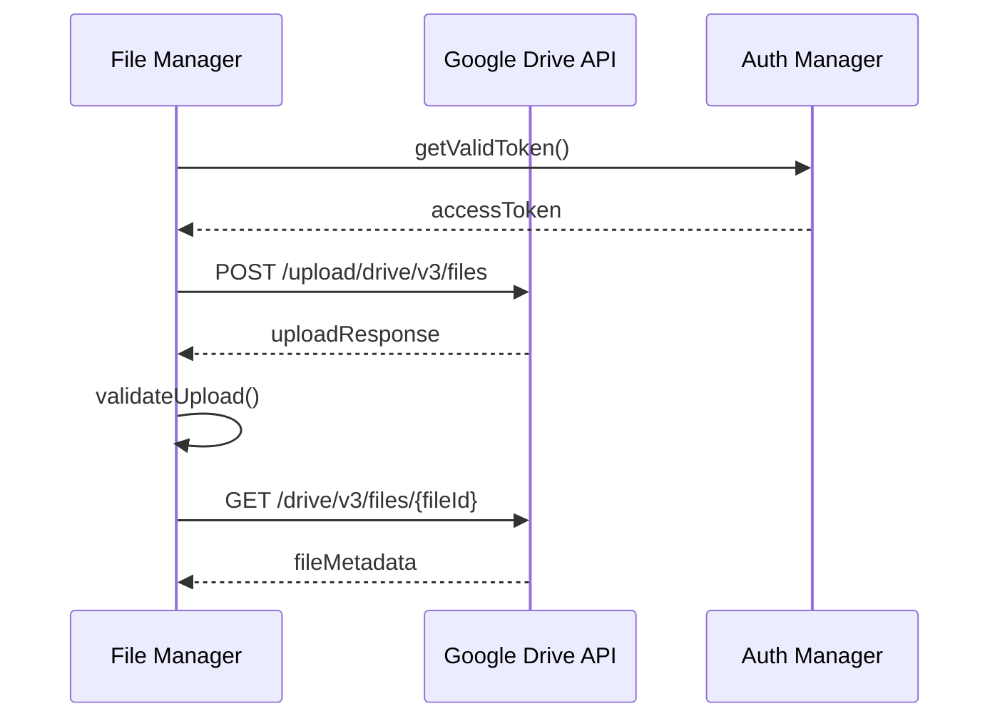
```mermaid
sequenceDiagram
    participant FM as File Manager
    participant GD as Google Drive API
    participant AM as Auth Manager
    
    FM->>AM: getValidToken()
    AM-->>FM: accessToken
    FM->>GD: POST /upload/drive/v3/files
    GD-->>FM: uploadResponse
    FM->>FM: validateUpload()
    FM->>GD: GET /drive/v3/files/{fileId}
    GD-->>FM: fileMetadata
```

## 🔒 セキュリティアーキテクチャ

### 1. データフロー セキュリティ

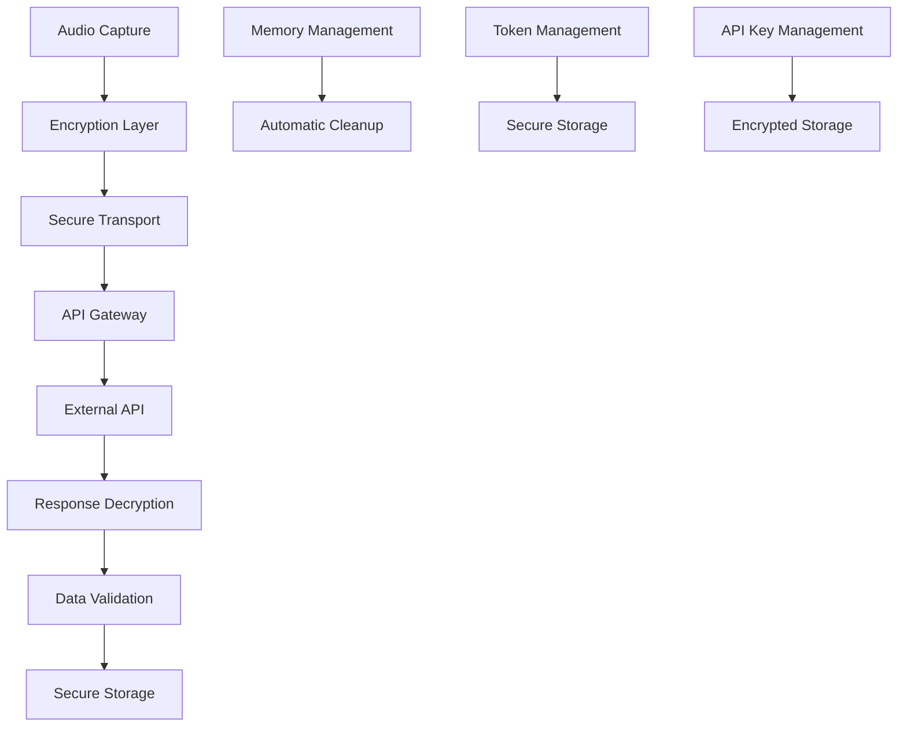
```mermaid
flowchart TD
    A[Audio Capture] --> B[Encryption Layer]
    B --> C[Secure Transport]
    C --> D[API Gateway]
    D --> E[External API]
    E --> F[Response Decryption]
    F --> G[Data Validation]
    G --> H[Secure Storage]
    
    I[Memory Management] --> J[Automatic Cleanup]
    K[Token Management] --> L[Secure Storage]
    M[API Key Management] --> N[Encrypted Storage]
```

### 2. 認証・認可フロー

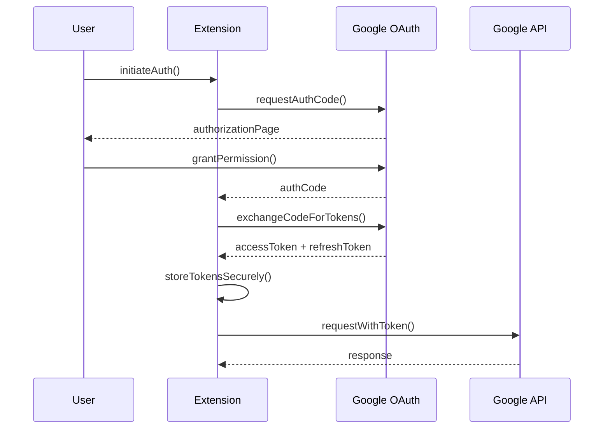
```mermaid
sequenceDiagram
    participant U as User
    participant EXT as Extension
    participant OAuth as Google OAuth
    participant API as Google API
    
    U->>EXT: initiateAuth()
    EXT->>OAuth: requestAuthCode()
    OAuth-->>U: authorizationPage
    U->>OAuth: grantPermission()
    OAuth-->>EXT: authCode
    EXT->>OAuth: exchangeCodeForTokens()
    OAuth-->>EXT: accessToken + refreshToken
    EXT->>EXT: storeTokensSecurely()
    EXT->>API: requestWithToken()
    API-->>EXT: response
```

## 📊 パフォーマンス設計

### 1. メモリ管理

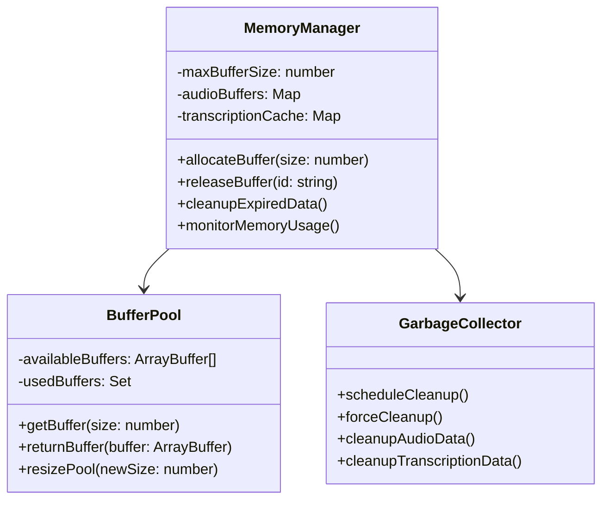
```mermaid
classDiagram
    class MemoryManager {
        -maxBufferSize: number
        -audioBuffers: Map
        -transcriptionCache: Map
        +allocateBuffer(size: number)
        +releaseBuffer(id: string)
        +cleanupExpiredData()
        +monitorMemoryUsage()
    }
    
    class BufferPool {
        -availableBuffers: ArrayBuffer[]
        -usedBuffers: Set
        +getBuffer(size: number)
        +returnBuffer(buffer: ArrayBuffer)
        +resizePool(newSize: number)
    }
    
    class GarbageCollector {
        +scheduleCleanup()
        +forceCleanup()
        +cleanupAudioData()
        +cleanupTranscriptionData()
    }
    
    MemoryManager --> BufferPool
    MemoryManager --> GarbageCollector
```

### 2. 非同期処理設計

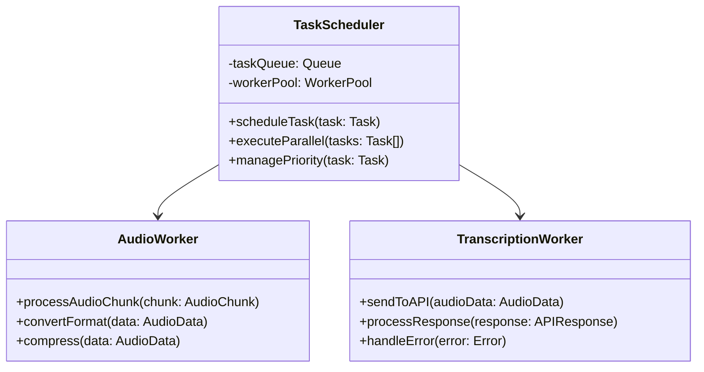
```mermaid
classDiagram
    class TaskScheduler {
        -taskQueue: Queue
        -workerPool: WorkerPool
        +scheduleTask(task: Task)
        +executeParallel(tasks: Task[])
        +managePriority(task: Task)
    }
    
    class AudioWorker {
        +processAudioChunk(chunk: AudioChunk)
        +convertFormat(data: AudioData)
        +compress(data: AudioData)
    }
    
    class TranscriptionWorker {
        +sendToAPI(audioData: AudioData)
        +processResponse(response: APIResponse)
        +handleError(error: Error)
    }
    
    TaskScheduler --> AudioWorker
    TaskScheduler --> TranscriptionWorker
```

## 🔄 状態管理

### 1. アプリケーション状態

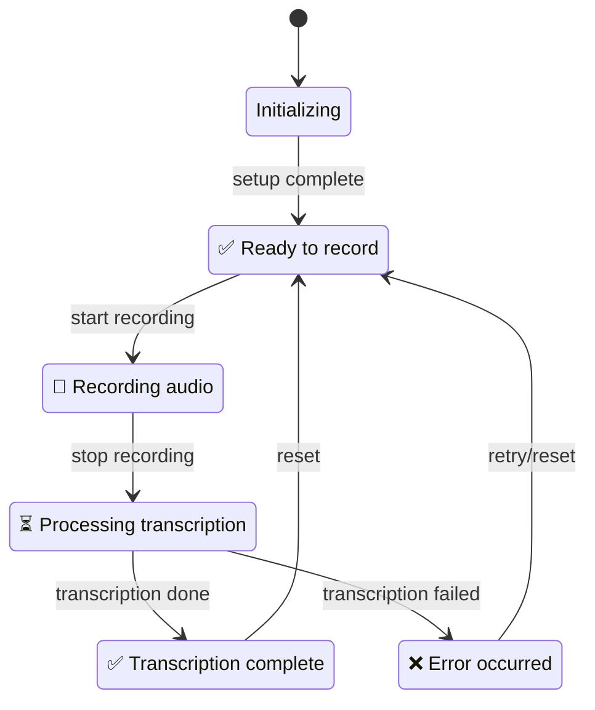
```mermaid
stateDiagram-v2
    [*] --> Initializing
    Initializing --> Ready: setup complete
    Ready --> Recording: start recording
    Recording --> Processing: stop recording
    Processing --> Completed: transcription done
    Processing --> Error: transcription failed
    Completed --> Ready: reset
    Error --> Ready: retry/reset
    
    Ready: ✅ Ready to record
    Recording: 🔴 Recording audio
    Processing: ⏳ Processing transcription
    Completed: ✅ Transcription complete
    Error: ❌ Error occurred
```

### 2. 設定状態管理

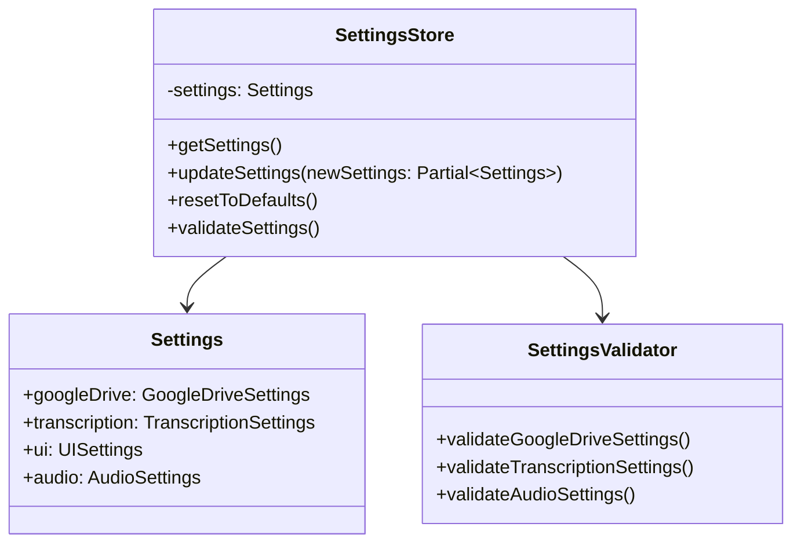
```mermaid
classDiagram
    class SettingsStore {
        -settings: Settings
        +getSettings()
        +updateSettings(newSettings: Partial~Settings~)
        +resetToDefaults()
        +validateSettings()
    }
    
    class Settings {
        +googleDrive: GoogleDriveSettings
        +transcription: TranscriptionSettings
        +ui: UISettings
        +audio: AudioSettings
    }
    
    class SettingsValidator {
        +validateGoogleDriveSettings()
        +validateTranscriptionSettings()
        +validateAudioSettings()
    }
    
    SettingsStore --> Settings
    SettingsStore --> SettingsValidator
```

## 🧪 テスト アーキテクチャ

### 1. テスト構造

```mermaid
graph TD
    subgraph "Unit Tests"
        UT1[Audio Recorder Tests]
        UT2[Transcription Engine Tests]
        UT3[File Manager Tests]
        UT4[Auth Manager Tests]
    end
    
    subgraph "Integration Tests"
        IT1[API Integration Tests]
        IT2[Chrome API Tests]
        IT3[Storage Tests]
    end
    
    subgraph "E2E Tests"
        E2E1[Full Recording Flow]
        E2E2[Settings Management]
        E2E3[Error Handling]
    end
    
    UT1 --> IT1
    UT2 --> IT1
    UT3 --> IT2
    UT4 --> IT2
    IT1 --> E2E1
    IT2 --> E2E2
    IT3 --> E2E3
```

### 2. テストダブル設計

```mermaid
classDiagram
    class MockAudioRecorder {
        +startRecording()
        +stopRecording()
        +getTestAudioData()
    }
    
    class MockTranscriptionAPI {
        +transcribe(audioData: AudioData)
        +returnMockResult()
    }
    
    class MockGoogleDriveAPI {
        +uploadFile(file: File)
        +returnMockResponse()
    }
    
    class TestDataGenerator {
        +generateAudioData()
        +generateTranscriptionResult()
        +generateFileMetadata()
    }
```

## 📈 監視・ログ設計

### 1. ログ アーキテクチャ

```mermaid
classDiagram
    class Logger {
        +debug(message: string)
        +info(message: string)
        +warn(message: string)
        +error(error: Error)
        +performance(metric: PerformanceMetric)
    }
    
    class LogLevel {
        <<enumeration>>
        DEBUG
        INFO
        WARN
        ERROR
    }
    
    class PerformanceMonitor {
        +startTimer(operation: string)
        +endTimer(operation: string)
        +recordMemoryUsage()
        +recordAPILatency()
    }
    
    Logger --> LogLevel
    Logger --> PerformanceMonitor
```

### 2. エラー ハンドリング

```mermaid
flowchart TD
    A[Error Occurred] --> B{Error Type}
    B -->|Network Error| C[Network Error Handler]
    B -->|API Error| D[API Error Handler]
    B -->|Auth Error| E[Auth Error Handler]
    B -->|Unknown Error| F[Generic Error Handler]
    
    C --> G[Retry Logic]
    D --> H[API Error Response]
    E --> I[Re-authentication]
    F --> J[Error Reporting]
    
    G --> K[User Notification]
    H --> K
    I --> K
    J --> K
```

## 🚀 配布・更新アーキテクチャ

### 1. ビルド・配布パイプライン

```mermaid
flowchart LR
    A[Source Code] --> B[Build Process]
    B --> C[Testing]
    C --> D[Package Creation]
    D --> E[Chrome Web Store]
    
    B --> F[Code Minification]
    B --> G[Asset Optimization]
    B --> H[Manifest Generation]
    
    F --> D
    G --> D
    H --> D
```

### 2. 自動更新システム

```mermaid
sequenceDiagram
    participant Chrome as Chrome Browser
    participant Store as Chrome Web Store
    participant Ext as Extension
    participant User as User
    
    Chrome->>Store: checkForUpdates()
    Store-->>Chrome: updateAvailable(version)
    Chrome->>Chrome: downloadUpdate()
    Chrome->>Ext: installUpdate()
    Ext->>Ext: migrateData()
    Ext->>User: notifyUpdateComplete()
```

---

**アーキテクチャ設計書作成日**: 2025年6月3日  
**最終更新日**: 2025年6月3日  
**作成者**: システムアーキテクト  
**承認者**: [承認者名]  
**バージョン**: 1.0

### 関連文書
- [要件定義書](requirement.md)
- [データフロー図](data-flow.md)
- [UIフロー図](ui-flow.md)
- [開発チェックリスト](checklist.md)
- [実装ガイドライン](implementation-guidelines.md)
- [テスト仕様書](※未作成)
