# Chrome拡張機能「動画音声文字起こしツール」アーキテクチャ設計書

## 🏗️ 概要
本文書では、Chrome拡張機能「動画音声文字起こしツール」のアーキテクチャ設計を詳細に定義し、システム全体の構造と各コンポーネントの役割を明確化します。

## 📐 全体アーキテクチャ図

```mermaid
graph TB
    subgraph "Chrome Extension"
        subgraph "Presentation Layer"
            UI[Popup UI]
            OPT[Options Page]
            NOT[Notifications]
        end
        
        subgraph "Service Layer"
            BG[Background Script]
            CS[Content Script]
        end
        
        subgraph "Data Layer"
            STOR[Chrome Storage API]
            CACHE[Memory Cache]
        end
        
        subgraph "Core Components"
            AR[Audio Recorder]
            TR[Transcription Engine]
            FM[File Manager]
            AM[Auth Manager]
        end
    end
      subgraph "External APIs"
        GSTT[Google Speech-to-Text<br/>高精度・多言語・有料]
        WSA[Web Speech API<br/>Chrome標準・無料・中程度精度]
        WHISPER[OpenAI Whisper<br/>高精度・多言語・有料]
        GDRIVE[Google Drive API]
        OAUTH[Google OAuth 2.0]
    end
    
    subgraph "Browser Environment"
        TAB[Active Tab]
        AUDIO[Audio Stream]
        CHROME[Chrome APIs]
    end
    
    UI --> BG
    OPT --> BG
    BG --> CS
    CS --> TAB
    TAB --> AUDIO
      BG --> AR
    AR --> TR
    TR --> GSTT
    TR --> WSA
    TR --> WHISPER
    BG --> FM
    FM --> GDRIVE
    BG --> AM
    AM --> OAUTH
    
    BG --> STOR
    BG --> CACHE
    BG --> NOT
    
    AUDIO --> AR
    CHROME --> BG
```



## 🎯 レイヤー構成

### 1. プレゼンテーション層 (Presentation Layer)

#### Popup UI


#### Options Page


### 2. サービス層 (Service Layer)

#### Background Script


#### Content Script


### 3. データ層 (Data Layer)

#### Storage Management


## 🔧 コアコンポーネント設計

### 1. Audio Recorder


### 2. Transcription Engine


### 3. File Manager


### 4. Auth Manager


## 📡 API インテグレーション設計

### 文字起こしエンジン選択戦略

各エンジンの特徴と選択基準：

| エンジン | 精度 | コスト | 接続性 | 多言語対応 | 推奨用途 |
|---------|------|--------|--------|------------|----------|
| Google Speech-to-Text | 高 | 有料 | API | 優秀 | 高品質が必要な場合 |
| Web Speech API | 中 | 無料 | ブラウザ標準 | 良好 | 基本的な文字起こし |
| OpenAI Whisper | 高 | 有料 | API | 優秀 | 多言語・高精度が必要 |

### 1. Google Speech-to-Text API


### 2. Web Speech API

Web Speech APIはChrome標準のブラウザAPIで、追加のAPIキーや認証が不要です。


**Web Speech API の特徴:**
- ✅ **Chrome標準**: 追加インストール不要
- ✅ **無料**: APIキーや課金不要
- ⚠️ **中程度の精度**: 基本的な用途に適用
- ✅ **リアルタイム処理**: ストリーミング対応
- ⚠️ **ネットワーク依存**: オンライン接続必須

**実装上の考慮事項:**
- `SpeechRecognition` APIの利用
- 言語設定と自動検出
- 継続的認識のための適切な設定
- エラーハンドリング（ネットワーク断、タイムアウト等）

### 3. OpenAI Whisper API


### 3. Google Drive API


## 🔒 セキュリティアーキテクチャ

### 1. データフロー セキュリティ


### 2. 認証・認可フロー


## 📊 パフォーマンス設計

### 1. メモリ管理


### 2. 非同期処理設計


## 🔄 状態管理

### 1. アプリケーション状態

```mermaid
stateDiagram-v2
    [*] --> Initializing
    Initializing --> Ready: setup complete
    Ready --> Recording: start recording
    Recording --> Processing: stop recording
    Processing --> Completed: transcription done
    Processing --> Error: transcription failed
    Completed --> Ready: reset
    Error --> Ready: retry/reset
    
    Ready: ✅ Ready to record
    Recording: 🔴 Recording audio
    Processing: ⏳ Processing transcription
    Completed: ✅ Transcription complete
    Error: ❌ Error occurred
```



### 2. 設定状態管理


## 🧪 テスト アーキテクチャ

### 1. テスト構造

```mermaid
graph TD
    subgraph "Unit Tests"
        UT1[Audio Recorder Tests]
        UT2[Transcription Engine Tests]
        UT3[File Manager Tests]
        UT4[Auth Manager Tests]
    end
    
    subgraph "Integration Tests"
        IT1[API Integration Tests]
        IT2[Chrome API Tests]
        IT3[Storage Tests]
    end
    
    subgraph "E2E Tests"
        E2E1[Full Recording Flow]
        E2E2[Settings Management]
        E2E3[Error Handling]
    end
    
    UT1 --> IT1
    UT2 --> IT1
    UT3 --> IT2
    UT4 --> IT2
    IT1 --> E2E1
    IT2 --> E2E2
    IT3 --> E2E3
```

### 2. テストダブル設計

```mermaid
classDiagram
    class MockAudioRecorder {
        +startRecording()
        +stopRecording()
        +getTestAudioData()
    }
    
    class MockTranscriptionAPI {
        +transcribe(audioData: AudioData)
        +returnMockResult()
    }
    
    class MockGoogleDriveAPI {
        +uploadFile(file: File)
        +returnMockResponse()
    }
    
    class TestDataGenerator {
        +generateAudioData()
        +generateTranscriptionResult()
        +generateFileMetadata()
    }
```

## 📈 監視・ログ設計

### 1. ログ アーキテクチャ

```mermaid
classDiagram
    class Logger {
        +debug(message: string)
        +info(message: string)
        +warn(message: string)
        +error(error: Error)
        +performance(metric: PerformanceMetric)
    }
    
    class LogLevel {
        <<enumeration>>
        DEBUG
        INFO
        WARN
        ERROR
    }
    
    class PerformanceMonitor {
        +startTimer(operation: string)
        +endTimer(operation: string)
        +recordMemoryUsage()
        +recordAPILatency()
    }
    
    Logger --> LogLevel
    Logger --> PerformanceMonitor
```

### 2. エラー ハンドリング

```mermaid
flowchart TD
    A[Error Occurred] --> B{Error Type}
    B -->|Network Error| C[Network Error Handler]
    B -->|API Error| D[API Error Handler]
    B -->|Auth Error| E[Auth Error Handler]
    B -->|Unknown Error| F[Generic Error Handler]
    
    C --> G[Retry Logic]
    D --> H[API Error Response]
    E --> I[Re-authentication]
    F --> J[Error Reporting]
    
    G --> K[User Notification]
    H --> K
    I --> K
    J --> K
```

## 🚀 配布・更新アーキテクチャ

### 1. ビルド・配布パイプライン

```mermaid
flowchart LR
    A[Source Code] --> B[Build Process]
    B --> C[Testing]
    C --> D[Package Creation]
    D --> E[Chrome Web Store]
    
    B --> F[Code Minification]
    B --> G[Asset Optimization]
    B --> H[Manifest Generation]
    
    F --> D
    G --> D
    H --> D
```

### 2. 自動更新システム

```mermaid
sequenceDiagram
    participant Chrome as Chrome Browser
    participant Store as Chrome Web Store
    participant Ext as Extension
    participant User as User
    
    Chrome->>Store: checkForUpdates()
    Store-->>Chrome: updateAvailable(version)
    Chrome->>Chrome: downloadUpdate()
    Chrome->>Ext: installUpdate()
    Ext->>Ext: migrateData()
    Ext->>User: notifyUpdateComplete()
```

---

**アーキテクチャ設計書作成日**: 2025年6月3日  
**最終更新日**: 2025年6月3日  
**作成者**: システムアーキテクト  
**承認者**: [承認者名]  
**バージョン**: 1.0

### 関連文書
- [要件定義書](requirement.md)
- [データフロー図](data-flow.md)
- [UIフロー図](ui-flow.md)
- [開発チェックリスト](checklist.md)
- [実装ガイドライン](implementation-guidelines.md)
- [テスト仕様書](※未作成)
