# Chrome拡張機能「動画音声文字起こしツール」データフロー図

## 📊 概要
本文書では、Chrome拡張機能「動画音声文字起こしツール」のデータフローを図解し、システム内でのデータの流れと処理過程を明確化します。

## 🔄 全体データフロー図

```mermaid
graph TD
    A[ユーザー] --> B[Chrome拡張機能UI]
    B --> C[Background Script]
    C --> D[Content Script]
    D --> E[Tab Audio Stream]
    E --> F[Audio Capture API]
    F --> G[Audio Data Buffer]    G --> H{文字起こしエンジン選択}
    H -->|Google| I[Google Speech-to-Text API]
    H -->|Web Speech| J[Web Speech API]
    H -->|OpenAI| K[OpenAI Whisper API]    I --> L[Text Response]
    J --> L
    K --> L
    L --> M[Text Processing]
    M --> N[File Generation]
    M --> N[Google Drive API]
    N --> O[Google Drive Storage]
    
    C --> P[Settings Storage]
    P --> Q[Chrome Storage API]
    
    B --> R[Notification System]
    R --> S[Chrome Notifications API]
```

## 🎯 詳細データフロー

### 1. 初期化・設定フロー

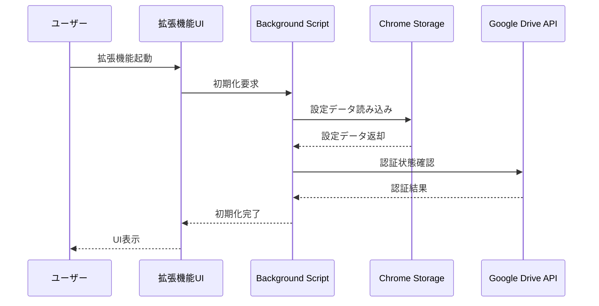

### 2. 録音・文字起こしフロー

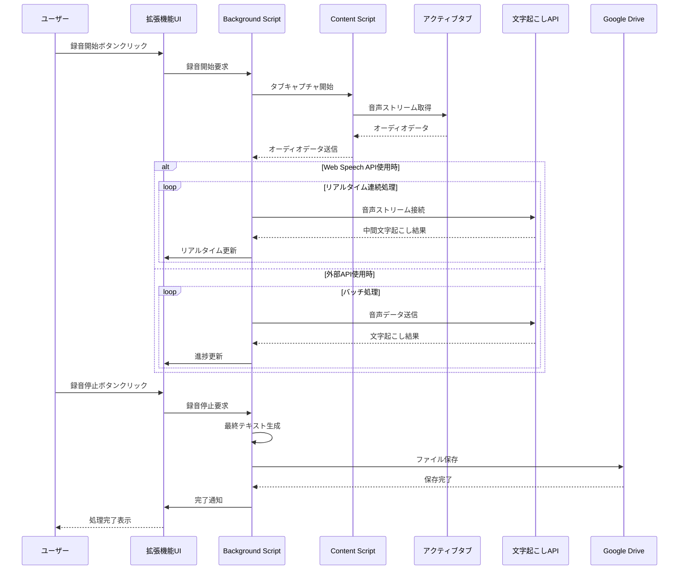

### 3. 設定管理フロー

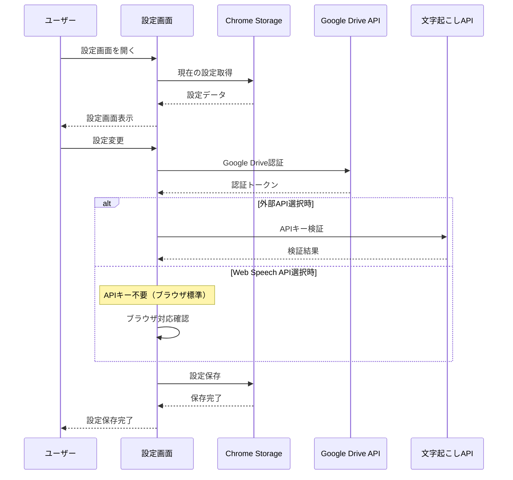

## 📋 データ要素定義

### 音声データ
```
AudioStreamData {
    format: "webm" | "wav",
    sampleRate: 16000, // Hz
    channels: 1, // モノラル
    bitRate: 128000, // bps
    duration: number, // 秒
    data: ArrayBuffer
}
```

### 文字起こし結果
```
TranscriptionResult {
    text: string,
    confidence: number, // 0.0-1.0
    language: string, // "ja", "en", etc.
    timestamp: number, // Unix timestamp
    alternatives?: string[]
}
```

### 設定データ
```
SettingsData {
    googleDrive: {
        accessToken: string,
        refreshToken: string,
        folderId: string,
        folderName: string
    },
    transcription: {
        engine: "google" | "webspeech" | "openai",
        apiKey?: string, // Web Speech APIでは不要
        language: string,
        quality: "standard" | "enhanced"
    },
    ui: {
        notifications: boolean,
        autoSave: boolean
    }
}
```

### ファイル情報
```
TranscriptFile {
    filename: string, // YYYY-MM-DD_HH-MM-SS_[title]_transcript.txt
    content: string,
    videoTitle: string,
    duration: number,
    language: string,
    createdAt: Date,
    fileId?: string // Google Drive file ID
}
```

## 🔍 データ処理詳細

### 1. 音声キャプチャ処理

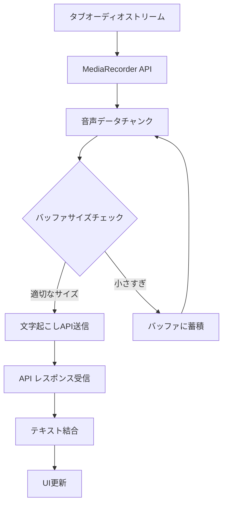

### 2. 文字起こしエンジン処理

#### Google Speech-to-Text
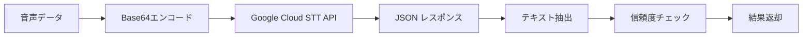

#### Web Speech API
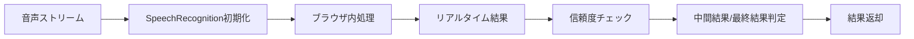

**Web Speech API の特徴:**
- ✅ **ブラウザ標準**: Chrome内蔵API、外部接続不要
- ✅ **リアルタイム処理**: 連続的な音声認識
- ✅ **無料**: APIキー・課金不要
- ⚠️ **中程度の精度**: 基本的な用途に適用
- ⚠️ **ネットワーク依存**: Googleサーバーとの通信が必要

**データフロー詳細:**
1. 音声ストリームを`SpeechRecognition`オブジェクトに接続
2. `continuous: true`でリアルタイム連続認識
3. `onresult`イベントで中間・最終結果を受信
4. `interim`フラグで中間結果と最終結果を判定
5. テキスト結果をUIにリアルタイム反映

#### OpenAI Whisper
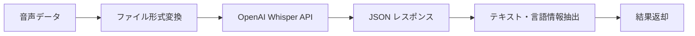

### 3. ファイル保存処理

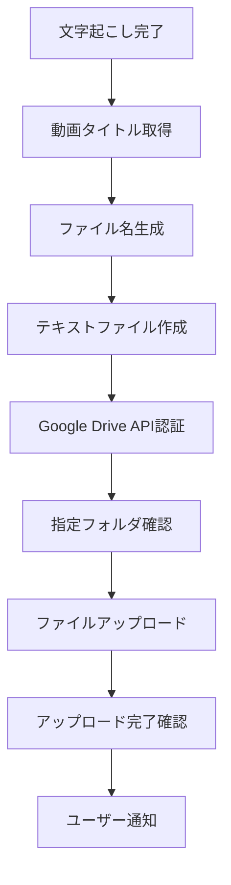

## 🔐 セキュリティ・プライバシーフロー

### 1. データセキュリティ
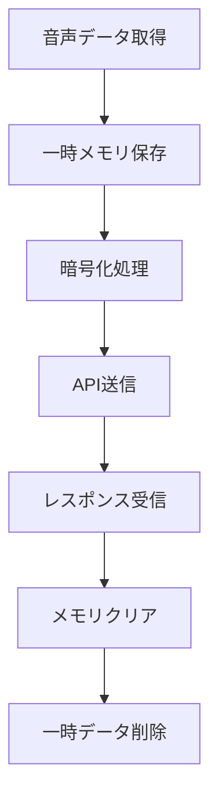

### 2. 認証フロー
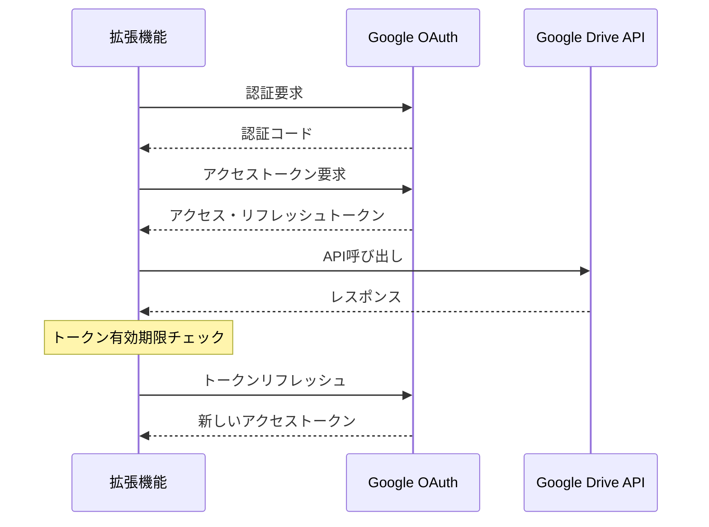

## ⚠️ エラーハンドリングフロー

### 1. ネットワークエラー
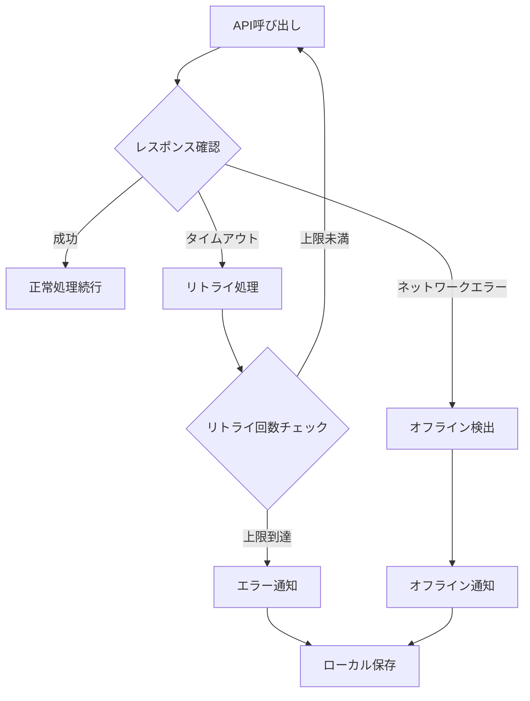

### 2. API制限エラー
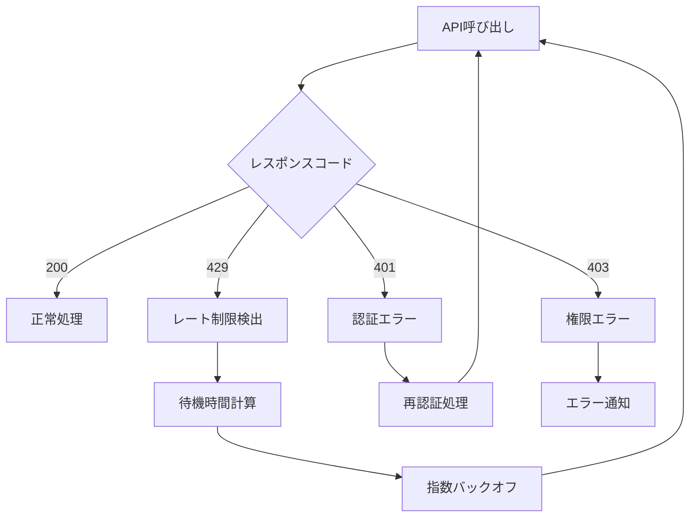

## 📊 パフォーマンス監視

### 1. メトリクス収集
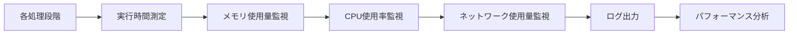

### 2. リソース管理
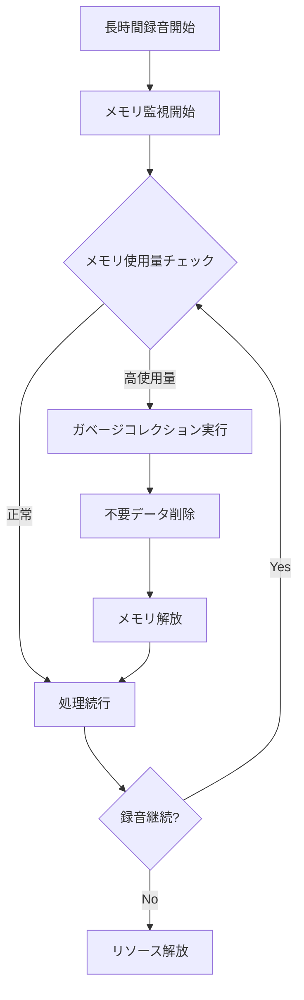

---

**データフロー図作成日**: 2025年6月3日
**最終更新日**: 2025年6月3日
**作成者**: システム設計チーム
**承認者**: [承認者名]

### 関連文書
- [要件定義書](requirement.md)
- [開発チェックリスト](checklist.md)
- [アーキテクチャ設計書](architecture.md)
