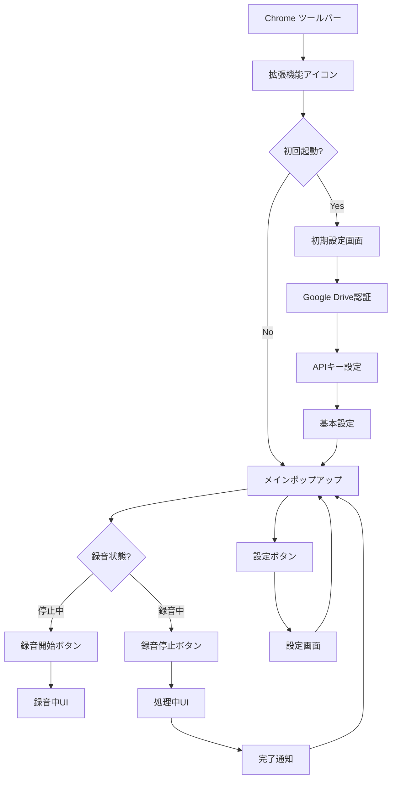
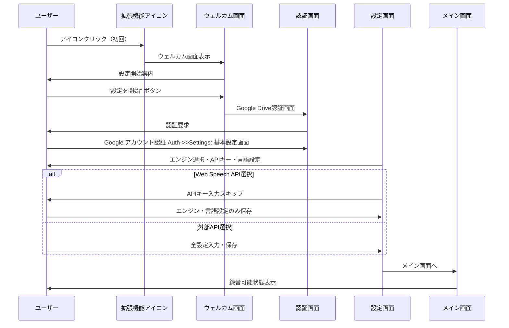
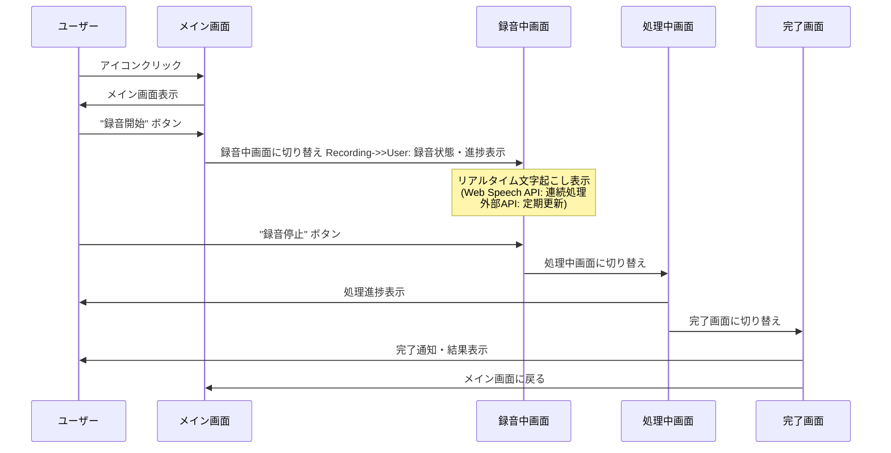
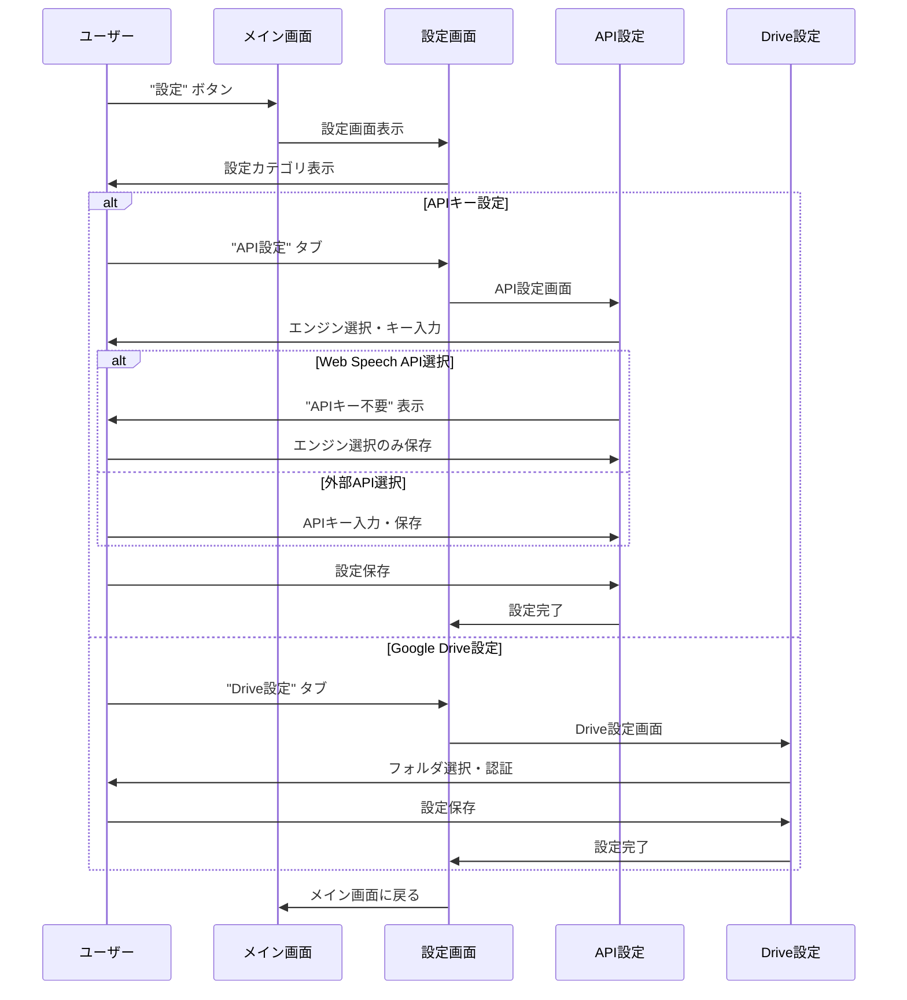
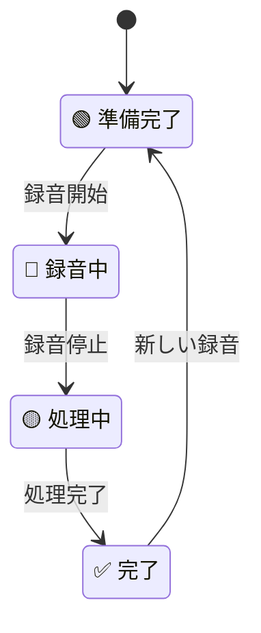
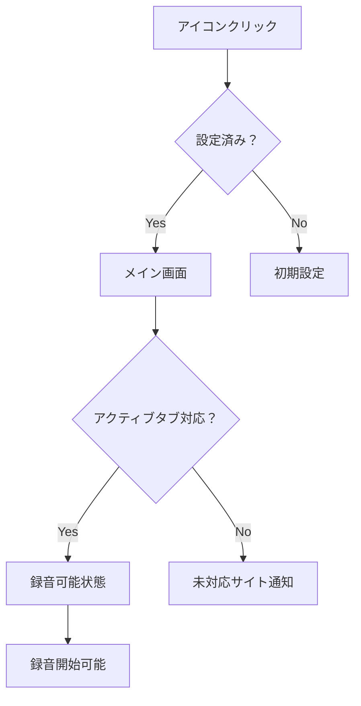
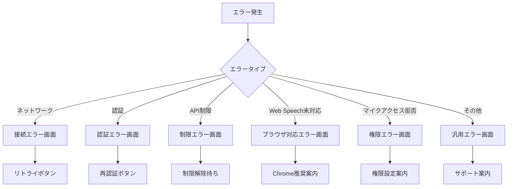
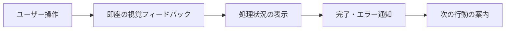

# Chrome拡張機能「動画音声文字起こしツール」UIフロー図

## 📱 概要
本文書では、Chrome拡張機能「動画音声文字起こしツール」のユーザーインターフェースの流れと画面遷移を図解し、ユーザーエクスペリエンスを明確化します。

## 🎯 全体UIフロー図



## 🖥️ 詳細画面フロー

### 1. 初回起動・設定フロー



### 2. メイン録音フロー



### 3. 設定管理フロー



## 📋 画面詳細設計

### 1. メインポップアップ画面

```
┌─────────────────────────────────┐
│ 🎙️ 動画音声文字起こしツール      │
├─────────────────────────────────┤
│                                 │
│  📹 現在のタブ: YouTube動画     │
│  🎯 状態: 準備完了              │
│  🤖 エンジン: Web Speech API    │
│                                 │
│  ┌─────────────────────────┐    │
│  │    🔴 録音開始             │    │
│  └─────────────────────────┘    │
│                                 │
│  ⚙️ 設定    📋 履歴    ❓ ヘルプ │
│                                 │
└─────────────────────────────────┘
```

### 2. 録音中画面

```
┌─────────────────────────────────┐
│ 🎙️ 録音中...                   │
├─────────────────────────────────┤
│                                 │
│  🔴 録音時間: 00:05:23          │
│  📊 音声レベル: ████████░░      │
│  🤖 エンジン: Web Speech API    │
│                                 │
│  📝 リアルタイム文字起こし:     │
│  ┌─────────────────────────┐    │
│  │今日は素晴らしい天気です...  │    │
│  │AIの技術について説明して...  │    │
│  │（連続文字起こし中...）     │    │
│  └─────────────────────────┘    │
│                                 │
│  ┌─────────────────────────┐    │
│  │    ⏹️ 録音停止             │    │
│  └─────────────────────────┘    │
│                                 │
└─────────────────────────────────┘
```

### 3. 処理中画面

```
┌─────────────────────────────────┐
│ ⏳ 処理中...                   │
├─────────────────────────────────┤
│                                 │
│  📊 進捗: ██████████░░ 80%     │
│                                 │
│  📝 最終処理中...               │
│  💾 Google Driveに保存中...    │
│                                 │
│  ⚠️ この画面を閉じないで         │
│     ください                   │
│                                 │
└─────────────────────────────────┘
```

### 4. 完了画面

```
┌─────────────────────────────────┐
│ ✅ 完了！                      │
├─────────────────────────────────┤
│                                 │
│  📄 ファイル名:                 │
│  2025-06-03_14-30-15_YouTube    │
│  _講義動画_transcript.txt       │
│                                 │
│  📁 保存先: Google Drive        │
│  📊 録音時間: 00:15:42          │
│  🤖 エンジン: Web Speech API    │
│  🌐 言語: 日本語               │
│                                 │
│  ┌─────────────────────────┐    │
│  │    📂 ファイルを開く        │    │
│  └─────────────────────────┘    │
│  ┌─────────────────────────┐    │
│  │    🔄 新しい録音を開始      │    │
│  └─────────────────────────┘    │
│                                 │
└─────────────────────────────────┘
```

### 5. 設定画面（Options Page）

```
┌─────────────────────────────────────────────────────┐
│ ⚙️ 設定                                            │
├─────────────────────────────────────────────────────┤
│                                                     │
│ 📑 [基本設定] [API設定] [Google Drive] [詳細設定]   │
│                                                     │
│ 🎯 基本設定                                         │
│ ┌─────────────────────────────────────────────────┐ │
│ │ 🌐 デフォルト言語: [日本語 ▼]                   │ │
│ │ 🎚️ 音声品質: [高品質 ▼]                        │ │
│ │ 🔔 通知設定: [✓] 完了時に通知                   │ │
│ │ 💾 自動保存: [✓] 録音停止時に自動保存           │ │
│ └─────────────────────────────────────────────────┘ │
│                                                     │
│ 🤖 文字起こしエンジン                               │
│ ┌─────────────────────────────────────────────────┐ │
│ │ ◉ Google Speech-to-Text (高精度・有料)         │ │
│ │ ○ Web Speech API (標準・無料・中程度精度)      │ │
│ │ ○ OpenAI Whisper (高精度・有料)                │ │
│ │                                                 │ │
│ │ 🔑 APIキー: [********************] [テスト]     │ │
│ │ ℹ️ Web Speech API選択時はAPIキー不要            │ │
│ └─────────────────────────────────────────────────┘ │
│                                                     │
│ ☁️ Google Drive設定                                │
│ ┌─────────────────────────────────────────────────┐ │
│ │ 🔐 認証状態: ✅ 接続済み                        │ │
│ │ 📁 保存フォルダ: /転写ファイル                   │ │
│ │ 🔄 [再認証] [フォルダ変更]                      │ │
│ └─────────────────────────────────────────────────┘ │
│                                                     │
│ ┌─────────────────────────┐ ┌─────────────────────┐ │
│ │         💾 保存         │ │      🔄 リセット    │ │
│ └─────────────────────────┘ └─────────────────────┘ │
│                                                     │
└─────────────────────────────────────────────────────┘
```

## 🎨 UIコンポーネント設計

### 1. ステータス表示

#### 録音状態インジケーター


#### 音声レベルメーター
```
音声レベル: ████████░░ (80%)
             ┌─────────┐
低音量 ──────┤ ████████ ├────── 高音量
             └─────────┘
```

### 2. ボタン設計

#### プライマリボタン（録音制御）
```
┌─────────────────────────┐
│    🔴 録音開始          │  ← 停止中
└─────────────────────────┘

┌─────────────────────────┐
│    ⏹️ 録音停止          │  ← 録音中
└─────────────────────────┘
```

#### セカンダリボタン
```
⚙️ 設定    📋 履歴    ❓ ヘルプ
```

### 3. 進捗表示

#### 処理進捗バー
```
📊 進捗: ██████████░░ 80%
        
段階別表示:
🎙️ 音声処理中...     (0-30%)
🤖 文字起こし中...   (30-80%)
💾 保存中...         (80-100%)

※Web Speech API使用時：
リアルタイム処理のため進捗表示は簡略化
🎙️ 最終処理中...
💾 Google Driveに保存中...
```

## 📱 レスポンシブ対応

### 1. ポップアップサイズ
```
標準サイズ: 320px × 480px
最小サイズ: 280px × 400px
最大サイズ: 400px × 600px
```

### 2. 設定画面サイズ
```
標準サイズ: 800px × 600px
最小サイズ: 600px × 500px
```

## 🔄 画面遷移ルール

### 1. 遷移条件


### 2. エラー時の画面遷移


## 🎯 ユーザビリティ設計

### 1. 操作の簡素化
- **ワンクリック録音**: メイン機能を最大ボタンで配置
- **状態の明確化**: 色とアイコンで直感的に状態表示
- **エラーの分かりやすさ**: 平易な言葉でエラー内容を説明

### 2. アクセシビリティ
- **キーボード操作**: 全ての操作をキーボードで実行可能
- **コントラスト**: WCAG 2.1 AA準拠の色彩設計
- **フォントサイズ**: 最小14px、重要な情報は16px以上

### 3. フィードバック設計


## 📊 画面パフォーマンス

### 1. 描画速度
- **初期表示**: 100ms以内
- **画面遷移**: 200ms以内
- **データ更新**: 50ms以内

### 2. メモリ使用量
- **ポップアップ**: 最大10MB
- **設定画面**: 最大15MB
- **バックグラウンド処理**: UI影響なし

## 🎤 Web Speech API特有のUI考慮事項

### 1. エンジン選択時の表示制御
- **APIキー入力欄**: Web Speech API選択時は非表示
- **費用警告**: 「無料」表示でユーザーに安心感を提供
- **精度表示**: 「中程度の精度」として期待値を適切に設定

### 2. リアルタイム処理の UI表現
- **連続文字起こし**: 文字が流れるような表示効果
- **中間結果表示**: グレーアウト文字で暫定結果を表示
- **確定結果**: 通常文字色で最終結果を表示

### 3. ネットワーク依存の通知
- **接続状態**: Web Speech APIはオンライン必須のため接続状態を監視
- **エラーハンドリング**: ネットワーク断時の適切なフォールバック表示

### 4. ブラウザ互換性の配慮
- **対応ブラウザ**: Chrome系ブラウザでのみ利用可能であることを明示
- **代替案提示**: 非対応時は他のエンジンへの切り替えを案内

## 🔔 通知システム

### 1. Chrome通知
```
┌─────────────────────────────────┐
│ 🎙️ 動画音声文字起こしツール     │
│                                 │
│ ✅ 文字起こしが完了しました     │
│ 📄 YouTube_講義動画.txt         │
│ 🤖 Web Speech API使用          │
│ 💾 Google Driveに保存済み       │
│                                 │
│ [開く] [閉じる]                 │
└─────────────────────────────────┘
```

### 2. インライン通知
```
┌─────────────────────────────────┐
│ ⚠️ 注意: マイクアクセスが        │
│    必要です                     │
│ [許可する] [後で]               │
└─────────────────────────────────┘

┌─────────────────────────────────┐
│ ℹ️ Web Speech API選択中         │
│    ネットワーク接続が必要です   │
│ [了解]                          │
└─────────────────────────────────┘

┌─────────────────────────────────┐
│ ⚠️ このブラウザはWeb Speech API │
│    に対応していません           │
│ [設定変更] [閉じる]             │
└─────────────────────────────────┘
```

---

**UIフロー図作成日**: 2025年6月3日
**最終更新日**: 2025年6月3日（Web Speech API対応追加）
**作成者**: UI/UX設計チーム
**承認者**: [承認者名]

### 更新履歴
- **2025年6月3日**: Web Speech API対応のUI要素追加
  - 設定画面でのエンジン選択オプション追加
  - APIキー不要の表示制御
  - リアルタイム処理UI表現の改善
  - エラーハンドリングの拡張
  - 通知システムのエンジン情報表示

### 関連文書
- [要件定義書](requirement.md)
- [データフロー図](data-flow.md)
- [開発チェックリスト](checklist.md)
- [デザインガイドライン](design-guidelines.md)
